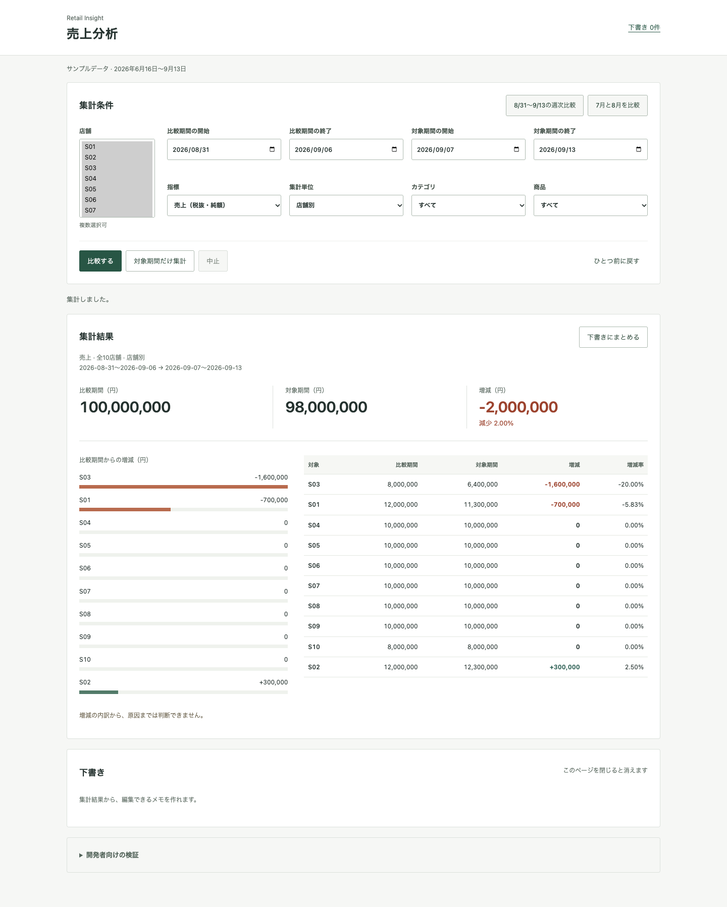
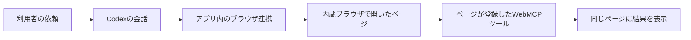
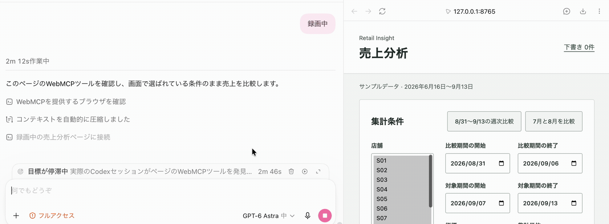
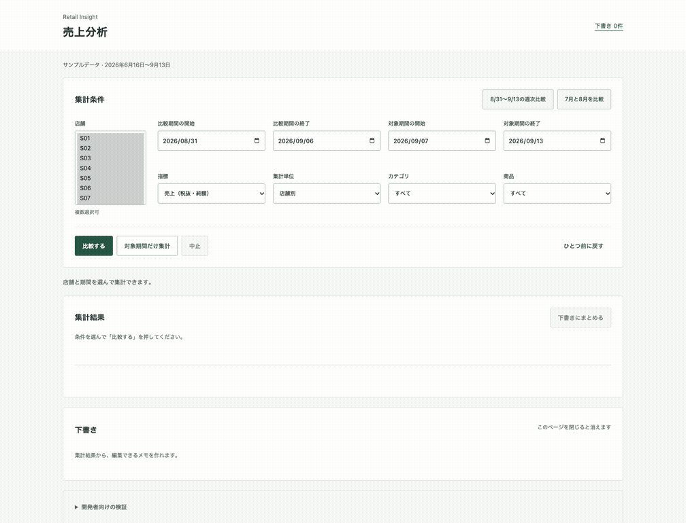
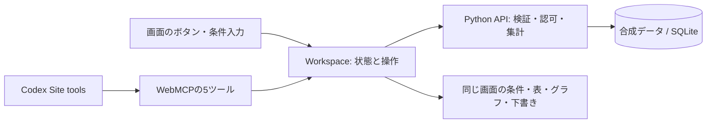

# WebMCP Retail Lab

人が開いている売上分析画面を、CodexもWebMCP経由で操作する技術検証です。
店舗・期間・指標を読み取り、比較し、同じ画面に結果を表示します。途中で人が条件を変更した場合は、古い結果で上書きせず、条件を取り直して集計します。

**2026-09-29、Codex内蔵ブラウザのSite toolsから5つのツールを実際に呼び出しました。** 条件取得、集計、画面表示、未保存の下書き作成、条件変更後の再集計まで確認しています。[検証記録](docs/verification.md)



## 動かす

Python 3.10以上が必要です。画面のビルド済みJavaScriptを同梱しているため、起動だけならNodeやAPIキーは不要です。

```sh
git clone https://github.com/akaitigo/webmcp-retail-lab.git
cd webmcp-retail-lab
python3 server.py
```

<http://127.0.0.1:8765> を開きます。「比較する」で、前週1億円から当週9,800万円への変化を確認できます。データはすべて合成です。

WebMCPが利用できないブラウザでも、通常の画面操作は使えます。「開発者向けの検証」で登録状況を確認できます。WebMCPの検出失敗を成功扱いにする代替実装はありません。

## Codexから試す

1. 上のサーバーを起動する。
2. Codex内蔵ブラウザで `http://127.0.0.1:8765` を開く。
3. Site toolsが使える環境で、例えば次のように依頼する。

> この画面の条件をWebMCPで読み取り、前週と比較して。減少額の大きい店舗をカテゴリ別に調べ、結果を画面に表示して。原因は断定せず、確認用の下書きを作って。

人が画面でS03・粗利額へ変更した後は、次のように続けます。

> 画面の条件を変えた。この条件を読み直して比較して。

今回のCodex検証では、ブラウザの`webmcp` capabilityで発見したツールに対して`tools.call(name, input)`を実行しています。DOMクリックによる集計や、アプリの内部関数を直接呼ぶ検証とは区別しています。Site toolsの提供条件は利用環境で異なります。[OpenAIのWebMCPガイド](https://learn.chatgpt.com/docs/webmcp)

## AIはどうやってブラウザにつながるのか

**AIとブラウザをつなぐ機能と、ページがWebMCPツールを公開する機能は別です。** WebMCPをサイトに実装しても、任意のCLIからそのブラウザへ自動的に接続できるようにはなりません。

今回動いたのは、Codexの会話と内蔵ブラウザを、デスクトップアプリのブラウザ連携でつなぐ構成です。



利用者の操作は次のとおりです。

1. Codexの内蔵ブラウザで対象サイトを開く。
2. 認証が必要なサイトなら、そのブラウザでログインする。
3. 横の会話で「このページの売上を比較して」と依頼する。
4. 対応するブラウザ連携を通じて、Codexがページのツールを検出・実行する。

「会話の横にサイトが開いている」構成でも、Site toolsの利用可否は環境に依存します。通常のページ操作ができることだけでは、WebMCP対応の証明にはなりません。[OpenAIのSite toolsガイド](https://learn.chatgpt.com/docs/webmcp)

### ログインが必要なサイトでは

WebMCPのツールは、ページの既存のログイン状態を利用する設計にできます。利用者がSSO・多要素認証などでログインし、ページのツールが通常の画面と同じ認証済みAPIを呼びます。モデルにパスワードやCookieそのものを渡す必要はありません。[WebMCP仕様](https://webmachinelearning.github.io/webmcp/)

ただし、ログイン済みであること、対象データを扱う権限があること、AIによる操作を利用者が許可していることは別です。例えばS01しか閲覧できない利用者がS03を指定した場合、サーバー側で拒否する必要があります。WebMCPの導入だけで認証・権限制御が完成するわけではありません。

普段のChromeと内蔵ブラウザでログイン状態が共有されるとは限らないため、AIが利用するブラウザ側でのログインを確認します。期限切れならサイトの通常の再ログイン手順に戻ります。

このデモはページの読み込み時にデモ用セッションを発行します。参照店舗の制限やセッション期限は検証していますが、実ユーザーのログイン、SSO、多要素認証は実装・検証していません。実録にある再読み込みでの復旧を、本番の再認証の検証とは扱いません。

## CLIから利用できるか

**今回のCodex CLI＋Chrome拡張連携では、WebMCPツールを検出できませんでした。** CLI 0.153.4での試験と、利用者が実施した0.158.0での再検証で確認しています。ページへの接続・DOMの読み取りはできましたが、タブに`webmcp` capabilityがなく、ツールの呼び出しには進めませんでした。

| 接続経路 | 確認結果 |
|---|---|
| Codexデスクトップ → 内蔵ブラウザのSite tools | ツールの検出・呼び出し・画面反映に成功 |
| Codex CLI → Chrome拡張連携 | ページ接続は成功。WebMCPツールは検出できず |

通常のMCPサーバーに接続できることと、ブラウザ内のWebMCPツールを利用できることは別です。この結果だけで「Codex CLIがWebMCP仕様に違反している」「アプリのWebMCP実装が壊れている」とは判断できません。今回確認した不足箇所は、CLIで利用したブラウザ連携がWebMCPの検出・実行機能を公開していない点です。

CLIから呼ぶためにMCPブリッジを追加する案はありますが、このリポジトリでは未実装・未検証です。掲載した実録GIFはデスクトップ版での実行です。[検証の詳細と仕様上の位置づけ](docs/verification.md#codex-cliでの検証)

## 動作例

### Codexの実セッション



利用者が録画した、実際のCodexの会話と内蔵ブラウザです。ページのツールを検出し、画面条件を取得、全店の週次売上を比較、S03をカテゴリ別に集計して同じ画面へ表示しています。途中のセッション期限切れと、再読み込み後の再実行も収録しています。

元動画の2分15秒から72秒間を等速で抜粋。別の会話名が映るサイドバーと下部ターミナルを切り取り、縮小・8fps化しました。会話やツールの応答は合成していません。[収録範囲と確認結果](docs/verification.md#codex実セッションの録画) · [編集記録](docs/media/codex-live-session.provenance.json)

### スクリプトによる自動再現



このGIFは、同梱スクリプトがChromeのネイティブ`document.modelContext`を呼んで収録した自動再現です。Codexの会話を録画したものではありません。

全店比較 → S03のカテゴリ内訳 → 画面で粗利額へ変更 → 古い結果の拒否 → 再集計 → 下書き、の順に進みます。[Codex実行時の画面](docs/media/codex-site-tools.png)も掲載しています。

## 共有する処理



| ツール | 役割 | 画面への影響 |
|---|---|---|
| `get_analysis_context` | 現在の条件と画面版を取得 | なし |
| `compare_periods` | 2期間を比較 | なし |
| `query_metrics` | 1期間を集計 | なし |
| `present_result` | 取得済み結果を表示 | 条件・表・グラフを更新 |
| `create_report_draft` | 結果を参照する下書きを作成 | 未保存の下書きを追加 |

UIとツールは同じ`Workspace`を通ります。集計用の処理をAI向けに二重実装していません。`context_id`は条件のスナップショットに対応し、表示時には集計元と現在の`view_version`を照合します。人の変更後に版番号だけ差し替えても、古い結果は表示できません。

下書きはページ内だけに存在します。同じキーで再実行しても増殖せず、人が編集した本文を上書きしません。保存・共有・送信は実装していません。

## 検証と開発

Node 22以上、Python 3.10以上を使用します。

```sh
npm ci
npm run verify
npx playwright install chromium
npm run test:browser
```

`verify`は型検査、ビルド、Node 26件、Python 36件を実行します。`test:browser`は通常UIの9件です。CIもこの範囲を実行し、ビルド済みファイルの差分を検査します。

WebMCP対応Chromeでは、追加でネイティブAPIとUI改修の13件を実行できます。

```sh
CHROME_PATH='/path/to/chrome' npm run test:native
```

実測したChrome **154.0.8037.58** では、`executeTool`の引数にJSON文字列が必要でした。この版では互換モードを明示します。

```sh
CHROME_PATH='/path/to/chrome' WEBMCP_TRANSPORT=chrome154-json npm run test:native
```

標準のオブジェクト入力とChrome 154向け互換入力は別扱いです。失敗時の自動切替・再実行は行いません。ブラウザテストは独立したプロファイルとsandboxを使い、ネイティブ検証時のみexperimental web platform featuresを有効にします。通常の閲覧プロファイルは使用しません。[ChromeのAPI説明](https://developer.chrome.com/docs/ai/webmcp/imperative-api)

GIF・画像はFFmpegを導入後、同じChromeで再生成できます。

```sh
CHROME_PATH='/path/to/chrome' WEBMCP_TRANSPORT=chrome154-json npm run record
```

`PYTHON`でPython実行ファイル、`HEADED=1`でブラウザの表示を指定できます。テストの生成物は`artifacts/`へ出力します。

## 検証の範囲

- 固定の10店舗・6カテゴリ・12商品、2026年6月16日〜9月13日の合成データを使います。実店舗の数値ではありません。
- 比率は分子と分母から再計算します。粗利率の差はパーセントポイントで表示します。
- セッションごとの参照店舗、CSRF、結果IDの所属・期限をサーバー側で確認します。S01だけの検証は `python3 server.py --port 8766 --scope S01` で起動します。
- localhost用の検証サーバーです。本番認証、永続保存、マルチユーザー運用、公開ホスティングは対象外です。
- 増減の内訳は分かりますが、天候・在庫・販促・来店人数などの原因はこのデータから判断できません。
- 複数モデルの比較評価や、すべてのブラウザでの互換性は検証していません。

UIはClaude Opus 4.5の静的レビューを受け、文言、差分の表示、再集計の導線、下書きの見せ方を修正しました。[変更内容](docs/design.md)

## ファイル

- `src/workspace.ts` — UIとツールの共有状態、競合・取消・下書き
- `src/webmcp.ts` — スキーマ、引数検証、ネイティブ登録
- `src/main.ts` / `static/` — 画面とビルド済みJavaScript
- `server.py` — Python標準ライブラリによるAPIと合成データ
- `tests/` / `scripts/` — 単体・実ブラウザ検証、収録
- `docs/` — 検証記録と画面・GIF

MIT License。依存パッケージにはそれぞれのライセンスが適用されます。
