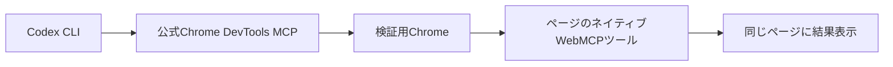
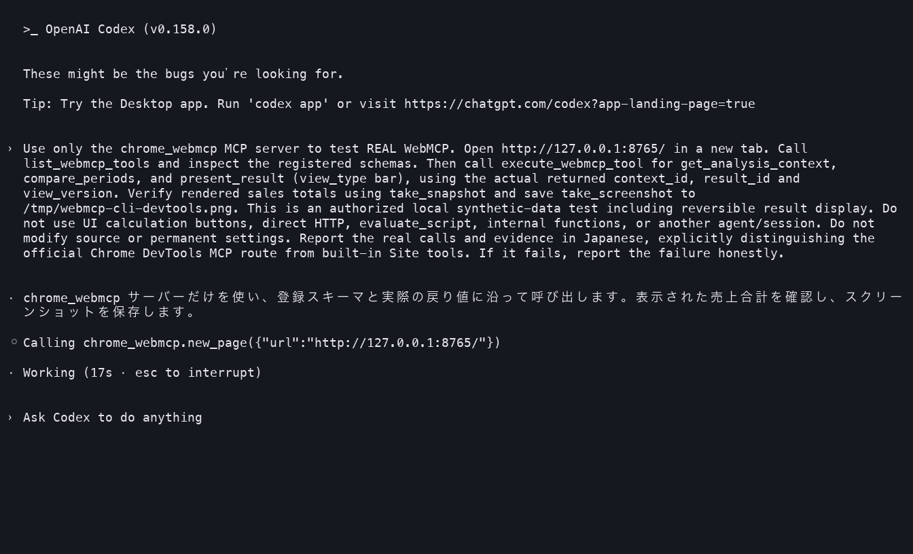
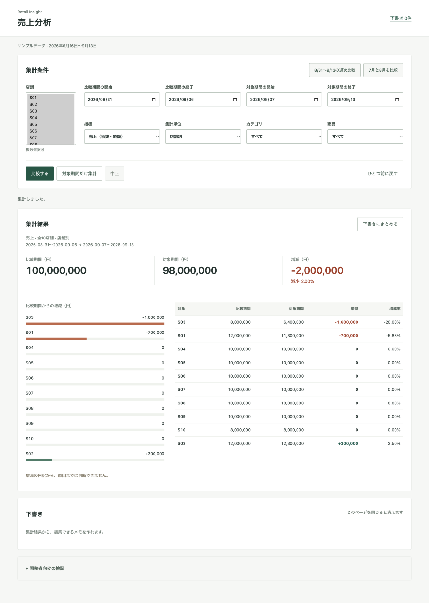

# Codex CLIからWebMCPを呼ぶ

2026-09-29、Codex CLI 0.158.0から、公式Chrome DevTools MCP 1.10.1を介してページのWebMCPツールを検出・実行できた。Chrome 154.0.8037.58、macOSで確認。アプリのコード変更や独自ブリッジは不要だった。



これは開発・デバッグ用の接続で、内蔵ブラウザのSite toolsや、通常のChrome拡張連携とは別経路。CLI単体が任意のブラウザのWebMCPを自動発見したわけではない。CLIがMCPサーバーの`list_webmcp_tools` / `execute_webmcp_tool`を呼び、サーバーがページのツールへ接続する。[Chrome公式ガイド](https://developer.chrome.com/docs/devtools/agents/webmcp-debugging)

## 再実行する

Node.js 22以上、Codex CLI、Chromeが必要。以下は検証したmacOS用の設定。`npx`は初回に指定版のパッケージを取得する。

リポジトリのルートでサーバーを起動し、このターミナルは開いたままにする。

```sh
python3 server.py --port 8765
```

別のターミナルで同じリポジトリを開き、次を実行する。MCP設定はこの起動だけに適用し、グローバル設定には追加しない。

```sh
codex --no-alt-screen --sandbox read-only --ask-for-approval on-request \
  -c 'mcp_servers.chrome_webmcp.command="npx"' \
  -c 'mcp_servers.chrome_webmcp.startup_timeout_sec=60' \
  -c 'mcp_servers.chrome_webmcp.args=["--yes","chrome-devtools-mcp@1.10.1","--isolated","--categoryExperimentalWebmcp","--chromeArg=--enable-features=WebMCP","--executablePath=/Applications/Google Chrome.app/Contents/MacOS/Google Chrome","--no-usage-statistics","--no-performance-crux","--no-javascript-evaluation","--no-category-memory","--no-category-performance","--no-category-emulation","--no-category-network","--viewport=1280x1000"]'
```

専用の一時プロファイルでChromeが起動する。普段のChromeのログイン状態は引き継がない。今回の合成データアプリではログイン不要。`--categoryExperimentalWebmcp`でMCP側の実験的ツールを、`--enable-features=WebMCP`でChrome側の機能を有効にする。[公式設定](https://github.com/ChromeDevTools/chrome-devtools-mcp/blob/main/docs/configuration.md)

次のプロンプトを貼り付ける。

```text
chrome_webmcp MCPサーバーだけを使い、実際のWebMCP呼び出しを検証してください。

http://127.0.0.1:8765/ を新しいタブで開き、list_webmcp_toolsで
ページが登録したツールと入力スキーマを取得してください。

execute_webmcp_toolで、順に以下を呼んでください。
1. get_analysis_context
2. compare_periods（返されたcontext_idを使う）
3. present_result（返されたresult_idと集計元のview_version、view_type=barを使う）

take_snapshotで、返却された売上合計と同じページの表示を照合してください。
take_screenshotはfilePathを付けず、画像を直接返してください。

合成データのローカル検証で、結果の画面表示まで依頼します。
集計ボタン、HTTP API直呼び、evaluate_script、アプリ内部関数、
別セッションへの委譲は使わず、ソースや永続設定も変更しないでください。
失敗はそのまま報告し、成功時は接続経路と実際の引数・返却値を示してください。
```

ツールの実行承認が表示された場合は、依頼した操作であることを確認してAllowを選ぶ。今回の検証は各回のAllowで実施し、Always allowや承認回避フラグは使っていない。WebMCPの`input`はMCPツールのスキーマに従ってJSON文字列で渡す。ページ固有のIDをプロンプトへ固定しない。

## 実行結果

| 操作 | 実測結果 |
|---|---|
| `list_webmcp_tools` | 5ツールの名前・説明・入力スキーマを取得 |
| `get_analysis_context` | 全10店舗、週次、売上、画面版1 |
| `compare_periods` | 100,000,000円 → 98,000,000円、差 -2,000,000円 |
| `present_result` | `ok: true`、画面版2 |
| `take_snapshot` | 画面の合計・差分が返却値と一致 |
| `take_screenshot`（filePathなし） | 画像取得成功。棒グラフと売上合計を確認 |

[実際のツール呼び出しと応答](cli-webmcp-results.json)。CLIの実行記録から対象呼び出しを抽出し、context/result IDだけ一貫した仮名に置換した。私的な会話や認証情報は含めない。今回実行したページツールは3種類であり、5種類すべてをCLIで呼んだとは扱わない。



これは対話的なCodex CLIのPTY出力を時刻付きで記録し、そのANSI出力を端末として再描画したGIF。OS画面の動画撮影ではない。実行記録の40〜116秒を0.5秒間隔で採取して等速再生し、文字色・フォントは再描画用に変更した。個人の作業パスを含む行は空白にした。会話・引数・応答の創作や差し替えはしていない。CLIが折りたたんだ応答はGIFでも省略表示のままなので、全応答は上のJSONで確認できる。[編集記録](media/codex-cli-webmcp.provenance.json)



画像取得では、最初にfilePathを指定した2回がMCPサーバーのワークスペース制限で拒否された。その後filePathを省略して画像を直接受け取り、成功した。許可範囲やツール設定の変更はしていない。これらの画像取得試行はGIFの抜粋後に実施した。WebMCPでの集計・画面反映は最初の実行で成功している。

## 先行試験との違い

先行するCLI 0.153.4の試験と、利用者が報告した0.158.0の試験は、`mcp__cua_repl`のChrome拡張連携を使った。そこで`webmcp` capabilityがなかった事実は変わらない。今回の成功は、同じCLI 0.158.0に別の公式MCPサーバーを接続することで得られた。

以前の「CLI利用には独自ブリッジが必要」という説明は調査不足だった。公式Chrome DevTools MCPに既存の接続経路があり、このリポジトリ独自のブリッジ実装は不要だった。認証付きサイト、普段のChromeプロファイルの引き継ぎ、CLIでの人との途中引き継ぎは今回の試験範囲に含めていない。
