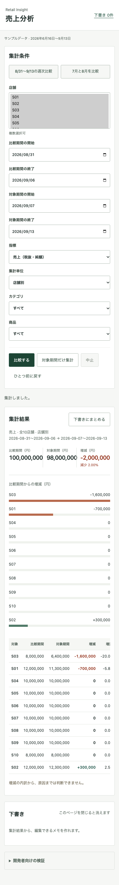

# UIの変更

Claude Codeの`--model opus`で静的レビューを実施。返却情報で実行モデルを`claude-opus-4-5-20251101`と確認した。レビュー対象は5枚の画面、HTML、CSS。利用者テストやアクセシビリティ監査ではない。

採用した指摘と追加の修正:

- 差分を符号・増減率・「増加／減少／増減なし」で示す。色だけに頼らない。
- 条件変更で結果を拒否した後、現在条件で再集計するボタンを置く。
- 上部に未保存下書きの件数と移動リンクを置く。
- 大きな宣伝文句、番号付きの説明、不要な英語見出しを外す。
- 画面版、JSON、トレース、WebMCP検証操作は折りたたむ。
- 下書きは数値と文章を編集する形に変える。根拠のIDは折りたたむ。
- 細い境界線と余白で情報を整理し、装飾より条件と結果を優先する。

レビュー中の「離脱警告がない」「中止ボタンが常時有効」という指摘は実装と一致しなかったため採用しなかった。「画面版」を「操作回数」と呼ぶ案も意味が変わるため採用しなかった。

