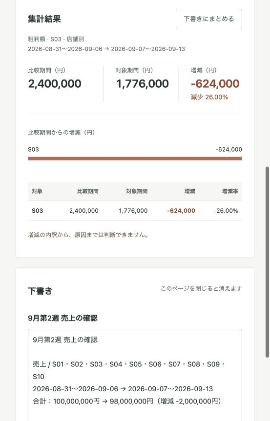

# 検証記録 — 2026-09-29

## Codex Site toolsでの実行

Codex内蔵ブラウザでローカルのアプリを開き、ページが登録した5ツールを発見して呼び出した。アプリ内の検証ボタンやPlaywrightの内部関数呼び出しを、この実績には含めていない。APIキーや外部の分析サービスは使用していない。

| 操作 | 確認した結果 |
|---|---|
| `get_analysis_context` | 全10店舗・週次・売上の画面条件、版1を取得 |
| `compare_periods` | 全店100,000,000円 → 98,000,000円、差 -2,000,000円 |
| `present_result` | 同じ画面の表・グラフを更新、版2 |
| `compare_periods` | S03のカテゴリ別集計。飲料 -1,200,000円 |
| `query_metrics` | S03・飲料の当週販売数量8,000点 |
| `create_report_draft` | 上の3結果を参照する未保存の下書きを作成 |
| 画面操作 | S03・粗利額へ変更。今回のSite tools試験ではCodexのUI操作で人の操作を再現 |
| 古い`present_result` | `VIEW_CHANGED`。条件を上書きしなかった |
| 再取得・再比較・表示 | 版4のS03・粗利額を継承。2,400,000円 → 1,776,000円、-624,000円（-26%）。表示後は版5 |
| 下書きの同一キー再実行 | `reused: true`、同じ下書きID、`saved: false` |

[実行結果JSON](site-tools-results.json)は実際の返却値を基に、ページ固有のcontext/result/draft IDを一貫した仮名に置き換えたもの。セッションCookie、CSRFトークン、私的な会話、ローカルパスを含めていない。実行時間は当該1回の値であり、性能ベンチマークではない。

これ以前の独立Chromeでの試験では、実際の利用者がS03・粗利額へ変更し、Codexが条件を再取得して分析を続ける引き継ぎも確認した。この先行試験は一時的なPlaywrightブリッジ経由であり、上記のSite tools実行とは別の試験である。

## Codex CLIでの検証

**追試で成功:** Codex CLI 0.158.0に公式Chrome DevTools MCP 1.10.1を接続し、5ツールの発見、条件取得・比較・結果表示の3種類の実行、画面との一致を確認した。[手順・プロンプト・実録・応答](cli-webmcp.md)。以下は、それとは接続経路が異なる先行試験の記録。

2026-09-29、Codex CLI 0.153.4で実施した対話的な試験では、Chromeの対象タブを取得・再読み込みできたが、タブのcapabilityに`webmcp`がなかった。続いて、利用者から共有されたCLI 0.158.0の実行報告でも同じ制約を確認した。後者は利用者の報告に基づく記録であり、このリポジトリの自動テスト結果ではない。

CLI 0.158.0で報告された操作と結果:

| 操作 | 結果 |
|---|---|
| ブラウザ連携の取得 | `mcp__cua_repl`経由のChrome extensionが利用可能 |
| 対象タブの取得 | ローカルの売上分析ページへの接続成功 |
| `browser.capabilities.list()` | `viewport`のみ |
| `tab.capabilities.list()` | `pageAssets`のみ |
| WebMCPツールの検出 | `webmcp` capabilityがなく、`fetchTools`を実行できず |
| 集計・結果表示 | WebMCP経由では未実行 |

例外エラーや集計失敗ではなく、検出に必要な機能が公開されていなかった。DOMに表示されるツール名は、WebMCP経由でツールやスキーマを取得した証拠には数えていない。集計ボタンのクリック、HTTP API直呼び、アプリ内部関数の実行、既存テスト、デスクトップ版の別セッションへの委譲による代替も、この試験の成功には含めない。

### 仕様と接続経路

2026-09-29に参照した[WebMCP仕様](https://webmachinelearning.github.io/webmcp/)はDraft Community Group Reportであり、確定したW3C標準ではない。WebページがJavaScriptのツールをブラウザ内で公開するAPIを定義している。ページがツールを登録しても、外部CLIとの接続が自動的に成立するわけではない。

[OpenAIのSite toolsガイド](https://learn.chatgpt.com/docs/webmcp)は、内蔵ブラウザでページのツールを発見・利用する機能を説明している。一方、[CodexのMCP対応](https://developers.openai.com/codex/mcp/)はローカルまたはリモートのMCPサーバーとの接続を扱う。通常のMCP対応と、ブラウザのWebMCP連携は分けて判断する必要がある。

今回の観測範囲では、CLIで利用したChrome連携がWebMCP機能を公開していないことが阻害要因だった。これをCLI全環境の非対応、仕様違反、モデルの能力不足、またはアプリの登録処理の不具合と断定しない。提供されるブラウザ・拡張機能・バージョンが変わった場合は再検証が必要。

追試では `Codex CLI → 公式Chrome DevTools MCP → ChromeのネイティブWebMCP → ページ` の既存経路で成功した。先行試験時点の「独自ブリッジが必要」という説明を訂正する。自作ブリッジは実装していない。CLI標準の直接対応とは区別し、公式MCPサーバー経由の成功として記録する。

## 自動テスト

公開前の環境: macOS、Node 25.2.1、TypeScript 5.8.3、Playwright 1.62.1、Chrome 154.0.8037.58。Python単体テストは3.12.14で再検証。ブラウザsandbox有効。

| 対象 | 結果 |
|---|---|
| TypeScript型検査・ビルド | 成功 |
| Python集計・HTTP・認可 | 36 / 36 |
| Node共有状態・ツール契約・transport | 26 / 26 |
| 実HTTP・通常UI | 9 / 9 |
| ネイティブWebMCP | 9 / 9 |
| UI改修 | 4 / 4 |

[ブラウザテストの結果](browser-tests.json)。成功の代わりにskipを数える処理はない。API未対応、入力形式不一致、アサーション失敗は非ゼロ終了となる。

通常UIと共有ハンドラーの数値一致、取消、undo、条件変更中の表示拒否、下書き編集保持、文字列のHTML化防止、店舗認可、別セッションの結果拒否、比率のポイント表記、390px幅の横はみ出しを確認した。

Chrome 154でオブジェクト入力が失敗した事実は残す。`chrome154-json`を明示してネイティブ試験を通した。これを標準オブジェクト入力の成功とは扱わない。Codex Site toolsの呼び出し側は構造化オブジェクトを渡し、ブラウザ連携側がtransportを処理する。

## 画像とGIF

`weekly.png`、`profit.png`、`mobile.png`と`demo.gif`は`npm run record`で再生成可能。合成データの画面を撮影している。GIFは静止画フレームを一定時間ずつ表示する操作デモで、実時間やモデルの思考時間を表現しない。`codex-site-tools.png`はCodex内蔵ブラウザの実行画面を直接撮影した。

## Codex実セッションの録画

2026-09-29、利用者がmacOSで画面収録した動画から、`media/codex-live-session.gif`を作成した。左が実際のCodexの会話、右が同じセッションの内蔵ブラウザ。上記の全5ツール検証とは別の実行であり、今回の録画では次の範囲を確認した。

1. ブラウザの`webmcp` capabilityから5ツールを発見。
2. `get_analysis_context`で全10店舗・週次・売上の条件を取得。
3. 最初の`compare_periods`は`UNAUTHENTICATED`。待機中にデモセッションが期限切れになっていたため、ページを再読み込みし、ツールと条件を取得し直した。
4. `compare_periods`は全店100,000,000円 → 98,000,000円、差 -2,000,000円を返した。
5. `present_result`が成功し、画面版は1から2へ更新。
6. 条件を再取得し、S03・カテゴリ別の`compare_periods`を実行。飲料の差は -1,200,000円。
7. `present_result`が成功し、画面版は3へ更新。表示された表・グラフの内容をDOMの読み取りでも照合した。

集計と結果表示にはWebMCPツールを使用した。集計結果の見出しへのクリックは表示位置の調整に使い、集計ボタンは押していない。映像ではツール行の一部が折りたたまれており、全引数・応答やグラフ全体が常時見えるわけではない。CLI経由の成功を示す映像でもない。

元動画は207.29秒、3024×1964。135秒から72秒間を順序・速度を変えずに抜粋し、左上(490,150)から2530×935を指定して切り出し（映像形式の偶数境界により実効高さ934）、1518×560、8fpsのGIFに変換した。サイドバーの別タスク名と下部ターミナルは公開範囲から除外。音声・文字の追加、会話の再現、応答の差し替えはしていない。元動画は公開せず、[編集記録](media/codex-live-session.provenance.json)に元動画とGIFのSHA-256および編集条件を残した。

## 元の目的との対応

| 目的 | 到達点 |
|---|---|
| UIとAIで同じ処理・状態を共有 | 共有Workspaceと実ブラウザで確認 |
| 人の選択条件をAIが読む | Codex Site toolsで確認 |
| 分析結果を同じ画面に返す | Codex Site toolsで確認 |
| 人の途中変更を尊重して続行 | 古い表示拒否と再集計を確認 |
| 数字に基づいた編集可能な下書き | 結果ID参照・冪等性・既存編集の保持を確認 |
| 実運用の業務システム | 対象外。合成データによる技術検証 |

## CI環境の調整

初回のUbuntu CIでは型検査・ビルド・単体テストまで通った後、Chromiumが`No usable sandbox`で起動できなかった。[初回の実行](https://github.com/akaitigo/webmcp-retail-lab/actions/runs/36511897308)。ブラウザ検証をmacOSランナーへ移し、sandbox有効と同じ9件のUIチェックを維持した。CIではネイティブWebMCPやCodexの実呼び出しは行わない。

macOS初回はサーバー起動の15秒上限に達した。単体テストにも35.7秒かかる環境だったため、起動待ちを60秒へ変更し、標準出力が分割されても起動URLを検出できるようにした。結果の数値・競合・画面の合否条件は変更していない。[該当実行](https://github.com/akaitigo/webmcp-retail-lab/actions/runs/36512021228)。
